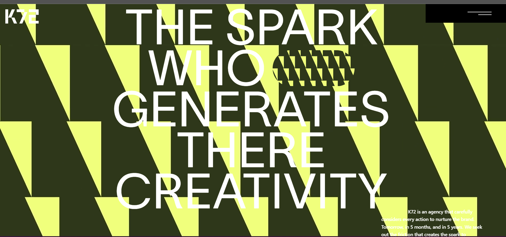
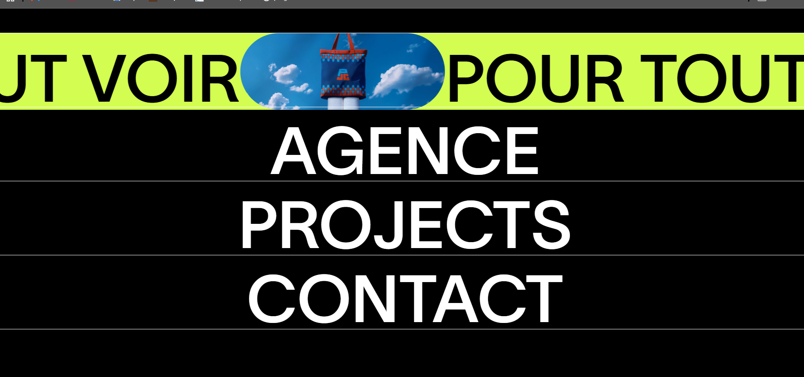
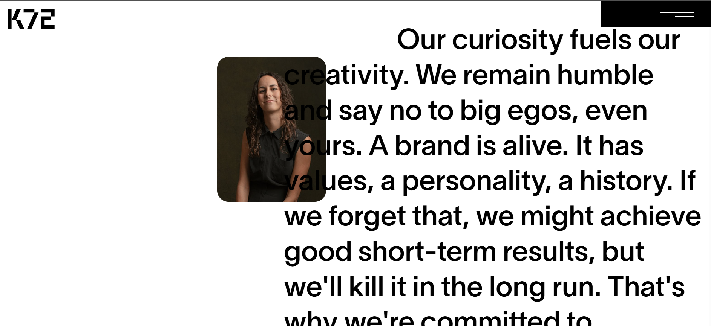
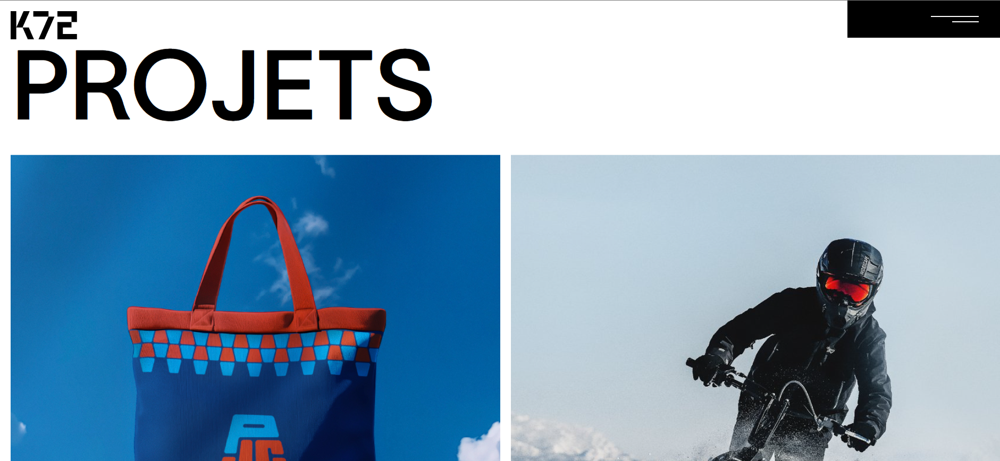

# K72 Website Clone

A responsive front-end clone of the **K72** website built using **React** and **Vite**. The project recreates the original website's modern design, smooth user experience, and responsive layout while following a clean, reusable component-based architecture.

---

## 🚀 Features

* Responsive design for all screen sizes
* Modern and minimal user interface
* Smooth scrolling and animations
* Reusable React components
* Fast development with Vite
* Clean and maintainable code structure

---

## 🛠️ Tech Stack

* React.js
* Vite
* JavaScript (ES6+)
* HTML5
* CSS3

---

## 📸 Screenshots

### 🏠 Home



### 🧭 Navigation Bar



### 🏢 Agence Section



### 💼 Projects Section



---

## ⚙️ Installation

### Clone the repository

```bash
git clone https://github.com/your-username/k72-clone.git
cd k72-clone
```

### Install dependencies

```bash
npm install
```

### Run the development server

```bash
npm run dev
```

Open the local URL shown in your terminal (usually `http://localhost:5173`).

---

## 📂 Project Structure

```text
k72-clone/
├── screenshots/
│   ├── home.png
│   ├── nav.png
│   ├── agence.png
│   └── projects.png
├── public/
├── src/
│   ├── assets/
│   ├── components/
│   ├── App.jsx
│   └── main.jsx
├── package.json
├── vite.config.js
├── README.md
└── .gitignore
```

---

## 📖 What I Learned

* Building reusable React components
* Creating responsive layouts using modern CSS
* Structuring scalable React applications
* Recreating real-world website interfaces
* Improving UI/UX implementation skills
* Working efficiently with the Vite development environment

---

## 🤝 Contributing

Contributions, suggestions, and feedback are welcome. Feel free to fork the repository, open an issue, or submit a pull request.

---

## 👨‍💻 Author

**Ishan Srivastava**

If you like this project, consider giving it a ⭐ on GitHub.
